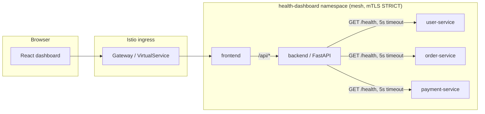

# Architecture

## Overview

The backend (`backend/`) is a FastAPI service that reads a declarative registry of downstream
services and checks each one concurrently over HTTP with a five-second timeout. It classifies
failures (`Timeout`, `Connection refused`, `HTTP 5xx`) rather than collapsing them into a single
generic error, because that distinction is what an operator actually needs when triaging an
incident. `user-service`, `order-service`, and `payment-service` are all served by one image
(`services/mock-service`) parameterized by environment variables, so the exercise's three named
services are deterministic and fully under the candidate's control rather than pointed at flaky
public endpoints.

The frontend (`frontend/`) is a small React/TypeScript app with no state management library and no
routing — a single view is all the problem calls for. It treats "the backend call itself failed"
(network error, non-2xx, malformed JSON) as a distinct state from "a downstream service reported
DOWN", because those require different operator responses.

## Deployment paths

Two ways to run the same containers, documented in the README:

1. **docker-compose** — fast local iteration and the safe fallback demo. No orchestration
   dependencies.
2. **kind + Terraform + Istio** — the DevSecOps target environment: a local single-node Kubernetes
   cluster (kept to one node given this host's memory budget - kind does not taint a lone
   control-plane node, so it stays schedulable), Terraform-managed namespace/workload/network-policy
   resources, and an Istio mesh layer providing mutual TLS, workload-identity authorization, and
   request rate limiting.

## Notable design decisions

**kind node image is left unpinned.** `infra/kind/kind-config.yaml` does not set an explicit
`image:` field. kind bundles a default node image with each release that is guaranteed compatible
with that release's binary; hardcoding a Kubernetes version tag risks referencing a node image the
installed kind binary cannot bootstrap, especially as kind releases roll forward. Reproducibility
instead comes from pinning the kind *binary* version in CI and in `scripts/install-prereqs.ps1`.

**NetworkPolicies are authored but not fully enforced pre-Istio.** kind's default CNI (kindnet)
does not implement the NetworkPolicy API. The policies in `infra/terraform/modules/app/main.tf`
(default-deny plus explicit allows) are real, applied IaC — they represent the intended access
model and would take effect immediately on a CNI that enforces them (Calico, Cilium, or any
managed cloud CNI). In this local demo, the access model is actually enforced by Istio's mutual
TLS and `AuthorizationPolicy` resources instead, once the mesh module applies. This gap is called
out explicitly here rather than silently implying enforcement that isn't there.

**Istio custom resources are applied via `kubectl` in a `local-exec` provisioner, not
`kubernetes_manifest`.** Terraform's `kubernetes_manifest` resource resolves each object's CRD
schema against the live cluster at plan time. On a first-ever apply, Istio's CRDs (installed by
the `istio-base` Helm chart in the same run) do not exist yet when the plan is evaluated, which
makes a single `terraform apply` fail. Shelling out to `kubectl apply` after the Helm releases
have already succeeded avoids that ordering problem. The tradeoff is that Terraform state does not
track those five objects individually — Kubernetes' own apply idempotency does. `scripts/deploy.ps1`
runs Terraform in two passes (control plane, then mesh policies) for the same reason.

**Rate limiting uses an `EnvoyFilter`, not a first-class Istio API.** As of the pinned Istio
release, there is no dedicated rate-limit custom resource; the documented mechanism is still an
`EnvoyFilter` installing Envoy's native `local_ratelimit` HTTP filter. This is presented as "the
currently supported pattern," not a newer stable API that doesn't exist yet.

**Terraform state is local.** `infra/terraform/*.tfstate*` is git-ignored. For a shared or
production environment, the `hashicorp/kubernetes`/`hashicorp/helm` provider blocks in
`providers.tf` would be paired with a remote backend (e.g. an S3 bucket with DynamoDB locking, or
Terraform Cloud) declared in `versions.tf`'s `backend` block — not implemented here since this
project targets a single local kind cluster.

## Why these tools

- **FastAPI + httpx**: native `asyncio` support makes concurrent health checks with per-request
  timeouts straightforward, and Pydantic gives the API a typed, validated response contract for
  free.
- **kind over minikube/k3d**: multi-node topology out of the box, runs entirely inside Docker
  Desktop, and is the de facto standard for CI-representative local Kubernetes testing.
- **Terraform for in-cluster resources, a script for cluster creation**: Terraform has no native
  concept of a kind cluster (it isn't a cloud API), so cluster lifecycle stays a thin
  `kind create cluster` wrapper while everything Terraform *is* good at — namespaces, workloads,
  Helm releases, network policy — is managed as code.
- **Istio over a simpler proxy**: the exercise explicitly asked for rate limiting; Istio provides
  that plus mutual TLS and identity-based authorization in one control plane, which is a more
  realistic shape for how this would be solved in a real platform team than a bespoke API gateway.
